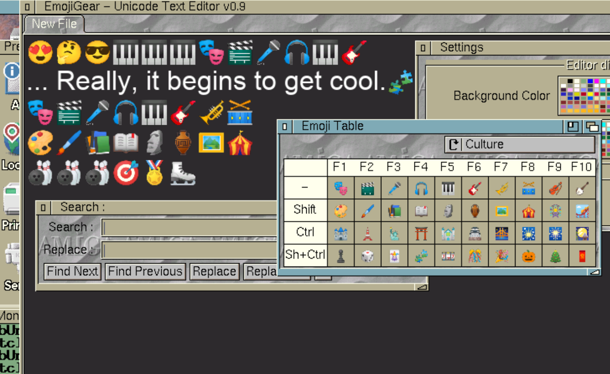
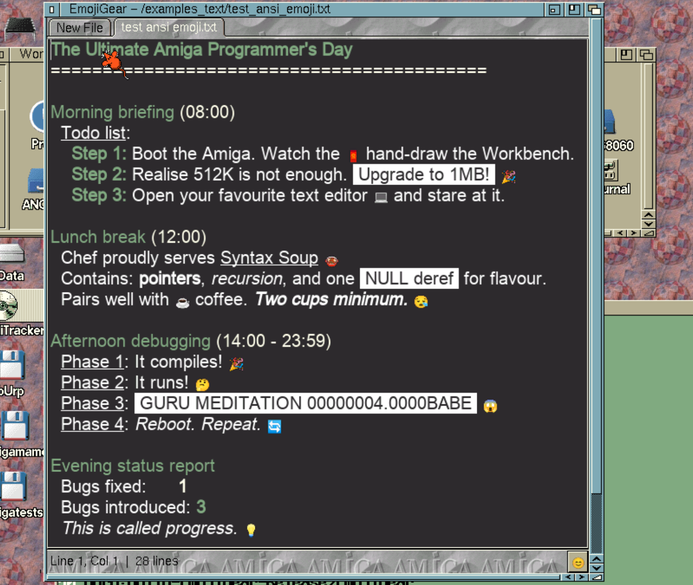
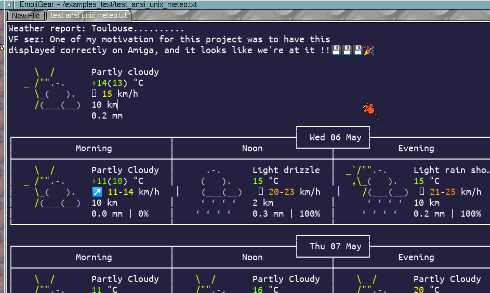

# EmojiGear
Amiga UTF8 Unicode FreeType rendering lib + BOOPSI text editor gadgets + Text Editor (+ ...?)

lib FreeType2 is used under FTL licence
 utf8rastport library, unitexteditor.gadget and unibutton.gadget are under licence LGPLv2
 see files FTL.txt for the freetype licence, and file LICENSE for LGPLv2

Having texts using the universaly acclaimed UTF-8 encoding, and Unicode in general, is one of the most super cool evolution in computer science over these past 25 years, even if you don't hear much about it. Look back at what spaghetti plate architectures microsoft and java had to manage in the 90's to handle multiple alphabets, endless numbers of encoding, and translation libraries, before UTF-8 Unicode appeared and made the world simple and the old stuff useless. And that's nothing compared to the fact it allows anyone to copy-paste emojis, flowers, licorns, and even poops, in the most serious documents, all that with a very elegant, non-resource consuming approach.

 Despite its very fast propagation on the 3 modern OSes (not mentioning servers and Web), close to no effort as been done to have a full UTF8 Unicode support in the Amiga OSes world, when those are known for their tight resource management. 

 
# W00t !
 
 So basically here is something for Amiga OS3: a shared library called utf8rastport.library, that embedd a recent FreeType2 lib with png support (for coolest emojis!), and have functions for:
 
  
  - ttf/odt Font rendering management, that allows up to 8 fallback fonts (which means you can have together many alphabet font and emoji font with a priority and fallback logic), it handles 2 level of glyph caches to render fast on all Amiga graphics mode (native or RTG). 
  
  - a truckload of rendering options (and yes, antialias).
    
  - metrics functions to know the pixel size of the UTF8 text you're about to draw, even for non-monospace fonts.

 - a text drawing function, that draws to Amiga struct RastPort and manage layers clipping, like all generic graphics rendering calls.
 
 - compiled for 68020, but well, glyph rendering is always done on the fly, and then memory cached, so first rendering will slow down things, but just the first. You may need a 50Mhz CPU to be ok, yet no FPU needed. Select the "low end" presets and unselect antialias, if your ttf fonts are 2 colors bitmap based it should go way faster and fits 68020 8Mb configs (theorically).
 
That said, the utf8rastport.library approach is to "bypass graphics.libary and fonts.library" Amiga text management, because they were made to manage one font at a time and consider texts are ANSI ISO encoded, so utf8rastport is a completely parallel system that will not patch existing app and existing os functions.

# UniTextEditor BOOPSI gadget

Tired of using IRC and mailer on Amiga and they would not display one of the thousand Emojis correctly ? You just want to open a recent documentation and you're favorite text editor won't be able to display character after code point 127 ?  No more hassle with UniTextEditor Gadget. Based on the brand new utf8rastport.library technology, and already used by acclamed apps like "Emoji Gear", UniTextEditor gadget will allow your Amiga apps using it to leap toward the future !

# Emoji Gear !

 The one and only Amiga OS3 text editor that allows you to:
  - Display and edit UTF-8 Unicode text that are the modern way on all OSes to type simple texts !
  - Display all emojis amonst the thousands existings, and rare symbols and characters, if they are found in one of the selected fonts. 
  - Have load/save and copy/paste functions to translate from and to legacy Amiga encoding (ANSI ISO Latin-1 and Latin-2 for east europe.)
  - Have special "Emoji Box" and use of function keys... to directly type funny emojis in your texts ! (Which is something no Windows/linux/OSX text editors have)
  - Search and replace and Undo/Redo stack, well that's mandatory.
  - Preferences for background and text color, antialias, font list.
  - Allows to change text size on the fly with Ctrl+/Ctrl- keys, Yes we're all 50 years old now with eyes issues. All modern text editor should do that.
  - multiple text edition with tabs, swappable with modern shortcut ctrl+tab and ctrl+shift+tab.
  - you can toggle "Word Wrap" ! (also a first on amiga Text editors ?) 
  - most modern selection and keyboard shortcuts works like tab-shifting multiple selected lines or double/triple click to select words and lines.
  - optionally render "ANSI escape" sequences to render colors, bold, italic,... like a unix shell, and look ! there's buttons for that.
  
  Nothing else for the moment... well, the aim was to have a confortable simple text editor with a Kickass name doing UTF8 Unicode. Further functionalities or app forks will be discuted from users feedbacks.

# Plans for other Apps..

 A DOS console device is planned, just so ssh and wget/curl requests that return emoji filled UTF8 texts and ansi color sequence are displayed correctly. an IRC and a mastodon client that actually display things the correct way, are planned but who knows when.
 
 

## Build Instruction for Amiga OS3

 
 This is to be cross-compiled with cmake and "Amiga bebbo gcc 6.5"
 which is at:
 https://github.com/AmigaPorts/m68k-amigaos-gcc

This compiler works well with C11. other gcc versions (actually developped)
and other C runtime versions doesnt provide a working C/C++ runtime, as far as tested today.
 ... follow instructions at this place to install the cross compiler on your linux/macos/windows.

 Then: 
  
 in a fresh dir:
 
 
 git clone https://github.com/krabobmkd/amigacommonlibs
 
 
 git clone https://github.com/krabobmkd/EmojiGear
 
 
 amigacommonlibs contains extra amiga SDK for libs that may have not been installed by m68k-amigaos-gcc,
 and a "cmake" platform. Previously the default install path for m68k-amigaos-gcc was /opt/amiga on linux and macos, and may have been "C:/c cygwin64/opt/amiga" on windows. Now because of evolutions on AmigaPorts/m68k-amigaos-gcc, it may be ~/amiga-gccxxx , you'll have to edit
 amigacommonlibs/cmake/Modules/Platform/m68k-amigaos.cmake and change variable M68KAMIGA_ROOT_PATH to this. (I had a code to do that automatically if compiler was in path, but it didn't work much)
 

 
 to configure a build, and then compile:
 
 
 cd EmojiGear
 
 
 mkdir buildAmiga
 
 
 cd buildAmiga
 
 
cmake ../EmojiGear  -DCMAKE_TOOLCHAIN_FILE=../../amigacommonlibs/cmake/Modules/Platform/m68k-amigaos.cmake -DCMAKE_BUILD_TYPE=Release
 
cmake --build .
 
 
  AmigaPorts m68k-amigaos-gcc version 6.5 used to install gracefully some extra SDK, but this is more and more optional. so you may have to add include path to ../../amigacommonlibs/extrasdk/SOMELIB/include . note amiga shared libs most of the times doesnt need a "link library", includes are enough to open the libs and call functions.
  
 
.. Note main project is the EmojiGear executable in EmojiGear, since it depends on libs projects libutf8rastport , UniButtonGadget, UniTextEditorGadget, they will also be generated.
 Just so you know: when you develop libraries, devices and boopsi classes on amiga, quitting apps that uses them is not enough to "flush the last version loaded in memory". you have to do that , and the amiga command "Avail flush", that triggers the "expunge" functions of not-retained libraries. So when you change code to a shared binary: 1. quit apps that uses it, 2. replace the binary 3. avail flush, then only test. 
 
